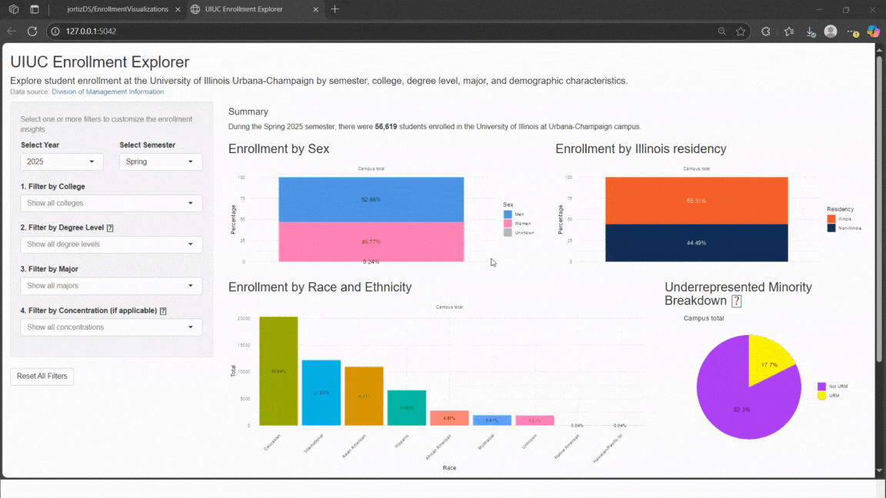

# UIUC Enrollment Visualization App

## Overview

As a woman in STEM, I often found myself reflecting on the changing makeup of my learning environments. I began my academic journey at an Elementary school in the Southwest side of Chicago, where 99% of students are underprivileged and Hispanic, and later attended Whitney Young, one of the most diverse high schools in the city. The shift to a predominantly white institution (PWI) like UIUC, and the noticeable lack of cultural, ethnic, and gender representation within my major—made me reflect on how diversity can look very different across academic spaces. That experience led me here. My goal was to turn personal curiosity into a resource that could help others better understand representation across departments.

This [R Shiny web application](https://jortizds-enrollmentvisualizations.share.connect.posit.cloud/) provides interactive visualizations and summaries of student enrollment data at the University of Illinois Urbana-Champaign (UIUC), filtered by semester, college, degree, major, and concentration. The app helps users explore enrollment trends across demographic dimensions such as race/ethnicity, sex, and residency.

The data covers enrollment from Fall 2004 to Spring 2025, with key changes over time:

- In Summer 2010, a new race/ethnicity classification system was adopted.

- In Fall 2020, data on Underrepresented Minorities (URM) was introduced.

These changes are reflected in the dashboard, which supports dynamic exploration across this full time range.

## Project Objective

The goal of this project is to:

- Make UIUC student enrollment data more accessible and visually intuitive.

- Provide summary statistics and charts to support data-driven decision-making.

- Highlight enrollment distributions by race/ethnicity, underrepresented minority status, sex, and Illinois residency.

## Data Sources

- This dashboard utilizes semester enrollment data sourced from the [Division of Management Information (DMI) - UIUC](https://dmi.illinois.edu/stuenr/#race). The data sets contain demographic records of students by curriculum.

## Process 

1. **Data Ingestion:** Web scraping was used to automatically download the enrollment data in Excel format from the DMI site. 
2. **Data Cleaning:** Data is cleaned and preprocessed to ensure accuracy and relevance, with formatting differences across years standardized during this process.
3. **Dynamic Filtering**: Users can filter data by semester, college, degree, major, and concentration.
4. **Visualizations**: Displays various plots and graphs for enrollment data across key demographic and academic categories.
5. **Data Summary**: Provides a textual summary of enrollment statistics, including totals and breakdowns based on selected filters.
6. **Dashboard Development:** An interactive R Shiny app is created to explore and visualize enrollment data.

## Technologies Used

- R: Main programming language for data processing and Shiny app.

- Shiny: Framework for building the web-based application.

- rvest: Used alongside httr and xml2 for web scraping and downloading Excel files.

- tidyverse: Data manipulation, plotting, and summarization.

- scales: For formatting numbers with commas (e.g., 1,000 instead of 1000).

- DT: Data tables for displaying filtered datasets.

## Dashboard
Access the interactive dashboard [here](https://jortizds-enrollmentvisualizations.share.connect.posit.cloud/)

